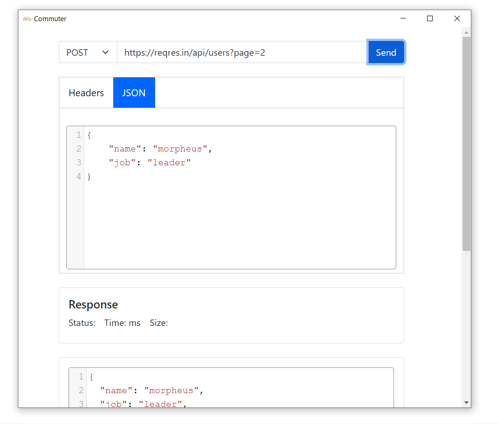

# Commuter - Windows Edition

 

API development tool used for testing and development of an API - Windows version

## Installation 

Head on to <a href="https://perfactors.com/commuter/">https://perfactors.com/commuter/</a> to download it bot for mac as well as windows.
